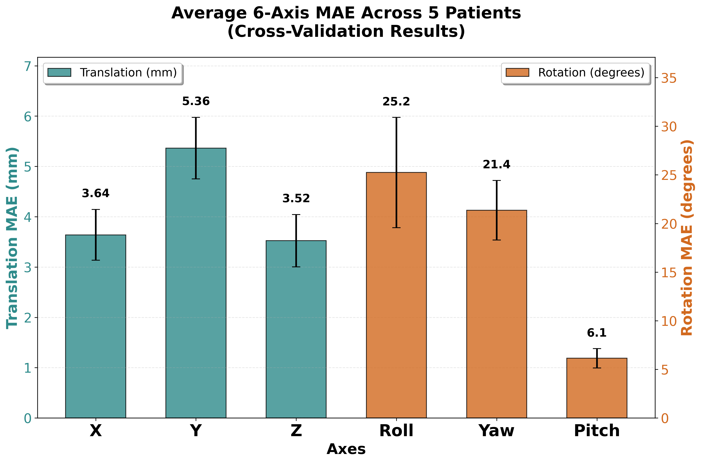

# Cardiac Dreamer: Real-time Handheld Ultrasound Navigation System Training Module

## Overview

Cardiac Dreamer is a deep learning-based training framework designed for real-time handheld ultrasound navigation systems. This project implements a concrete realization of the "Cardiac Copilot" system architecture proposed in the research paper ["Cardiac Copilot: Automatic Probe Guidance for Echocardiography with World Model"](https://arxiv.org/abs/2406.13165) (MICCAI 2024).

> Note: This repository focuses on the model training phase and does not include deployment or real-time inference integration.

The system combines ResNet34 feature extraction with a novel Channel Token Transformer architecture, utilizing 512 channel tokens plus one Action-CLS token to process ultrasound images and predict optimal probe movements. This implementation follows the data-driven world model approach described in the original paper, enabling intelligent probe guidance for echocardiography and helping clinicians achieve optimal ultrasound imaging views through automated 6-DOF (six degrees of freedom) action predictions.

This approach addresses the critical challenge of ultrasound probe positioning, which traditionally requires extensive training and experience. The dataset used for training was collected with the invaluable support of [ACO SmartCare](https://acohealthcare.com/zh/about/%E9%97%9C%E6%96%BC/).


> model architecture overview


## Documentation Structure

This repository includes comprehensive documentation organized as follows:

- **[Introduction](docs/01_introduction.md)**: Background, motivation, and research objectives
- **[System Overview](docs/02_system_overview.md)**: Hardware and software architecture
- **[Data Management](docs/03_data.md)**: Dataset format and processing pipeline
- **[Model Architecture](docs/04_model_architecture.md)**: Detailed technical implementation with code explanations
- **[Setup Guide](docs/05_setup_and_install.md)**: Environment configuration and installation
- **[Experimental Results](docs/06_results.md)**: Performance analysis and validation results

## Requirements

- Python 3.10+
- PyTorch 2.2.2+
- CUDA-compatible GPU (recommended)
- 16GB+ RAM for full dataset training
- See [Setup Guide](docs/05_setup_and_install.md) for detailed requirements


## Model Performance

### Result Overview

Our 5-fold cross-validation evaluation demonstrates the model's capability in 6-DOF ultrasound probe guidance:



**Translation Performance**:
- X-axis: 3.64mm 
- Y-axis: 5.36mm   
- Z-axis: 3.52mm 

**Rotation Performance**:
- Roll: 25.2° 
- Yaw: 21.4° 
- Pitch: 6.1° 


See [Experimental Results](docs/06_results.md) for detailed performance analysis, validation methodology, and demo videos.

## Development Workflow

1. **Environment Setup**: Configure Python environment and dependencies
2. **Data Preparation**: Process ultrasound sequences and action annotations
3. **Model Training**: Execute training with cross-validation
4. **Evaluation**: Analyze results and generate performance reports

## License

This project is developed for academic research purposes. Please refer to the license file for usage terms and conditions.

## Citation

If you use this work in your research, please cite the original paper:

```bibtex
@article{jiang2024cardiac,
  title={Cardiac Copilot: Automatic Probe Guidance for Echocardiography with World Model},
  author={Jiang, Haojun and Sun, Zhenguo and Jia, Ning and Li, Meng and Sun, Yu and Luo, Shaqi and Song, Shiji and Huang, Gao},
  journal={arXiv preprint arXiv:2406.13165},
  year={2024}
}
```

This implementation is based on the research presented in: [Cardiac Copilot: Automatic Probe Guidance for Echocardiography with World Model](https://arxiv.org/abs/2406.13165) (MICCAI 2024).

## Support

For questions about installation, usage, or technical implementation, please refer to the documentation sections listed above.
