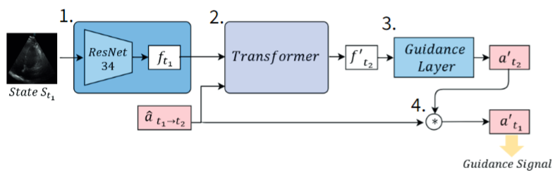

# System Overview

## Architecture Components

The Cardiac Dreamer training system is a four-stage pipeline that processes ultrasound images to predict optimal 6-DOF probe adjustments. Each stage transforms the input toward the final guidance output.

*Figure: End-to-end architecture with the four processing stages*

### Stage 1: Feature Extraction (ResNet34)
Single-channel 224×224 ultrasound images are encoded by a ResNet34 backbone into feature maps of shape [B, 512, 7, 7]. Implementation: [`src/models/backbone.py`](../src/models/backbone.py). Supports ImageNet-pretrained weights and custom init; selective layer freezing is available.

### Stage 2: Channel Tokenization
The [B, 512, 7, 7] feature maps are reshaped into 512 channel tokens, each with 49 spatial features (7×7). Implementation: [`src/models/dreamer_channel.py`](../src/models/dreamer_channel.py).

### Stage 3: Transformer Processing
A Transformer encoder consumes 512 channel tokens plus one Action-CLS token (total 513). Configuration: 6 layers, 12 heads, 768 hidden size; positional encoding preserves spatial relations. Implementation: [`src/models/dreamer_channel.py`](../src/models/dreamer_channel.py).

### Stage 4: Guidance Prediction
Pooled token features form a 512-d vector that passes through an MLP (512 → 1024 → 512 → 6) to predict 6-DOF actions. The module outputs both the primary composed action at t1 and an auxiliary t2 action. Implementation: [`src/models/guidance.py`](../src/models/guidance.py).

## Software Framework

### Training Infrastructure
Training is orchestrated with PyTorch Lightning, integrating backbone, Dreamer, guidance head, losses, and schedulers in a single system module: [`src/models/system.py`](../src/models/system.py).

### Configuration Management
YAML configs in `configs/` control model and training settings. Loader and helpers reside in [`src/config/`](../src/config/) and [`src/config/config_manager.py`](../src/config/config_manager.py), enabling reproducibility and easy overrides.

### Data Processing Pipeline
Patient-level datasets with transitions and 6-DOF annotations are handled in [`src/data/`](../src/data/) with the main dataset in [`src/data/dataset.py`](../src/data/dataset.py). Cross-patient splits and utilities: [`src/data/patient_splits.py`](../src/data/patient_splits.py). Optional augmentations (rotation/brightness/contrast/noise, MixUp): [`src/data/augmentation.py`](../src/data/augmentation.py).

### Training Utilities
- **Data Loaders**: [`src/training/data_loaders.py`](../src/training/data_loaders.py)
- **Callbacks**: [`src/training/callbacks.py`](../src/training/callbacks.py)
- **Schedulers & helpers**: [`src/training/schedulers.py`](../src/training/schedulers.py)
- **Loggers**: [`src/training/loggers.py`](../src/training/loggers.py)
- **Visualization**: [`src/visualization/training_visualizer.py`](../src/visualization/training_visualizer.py)

## Cross-Validation Strategy

### Patient-Level Validation
We use 5-fold cross-validation with strict patient-level separation. Five patient groups are predefined; in each fold, one group is held out for validation and the remaining four for training.

### Execution
The CV driver trains all folds, aggregates results, and produces plots/reports: [`src/train_cross_validation.py`](../src/train_cross_validation.py).

## Data Flow

1. Input image (t1) and relative action (t1→t2) are loaded from patient folders
2. Backbone encodes image → feature map ft1 = [B, 512, 7, 7]
3. Dreamer tokenizes and processes ft1 with the action → predicted next-token features
4. Guidance MLP generates 6-DOF predictions (primary composed action at t1, auxiliary action at t2)
5. Losses compare predictions to ground truth (SmoothL1 for main and auxiliary tasks)
6. Optimizer and scheduler update parameters

## Implementation Scope

### Current Implementation
The repository focuses on model development and validation, including complete training loops, cross-validation, and evaluation/visualization utilities required for robust guidance modeling.

### System Limitations
- Offline training/evaluation only; real-time inference and clinical integration are out of scope
- Operates on preprocessed datasets (no live ultrasound streaming)

### Integration Interfaces
Trained weights are exported as standard PyTorch checkpoints. The modular design allows extracting individual components (backbone, Dreamer, guidance) for downstream integration in real-time systems.