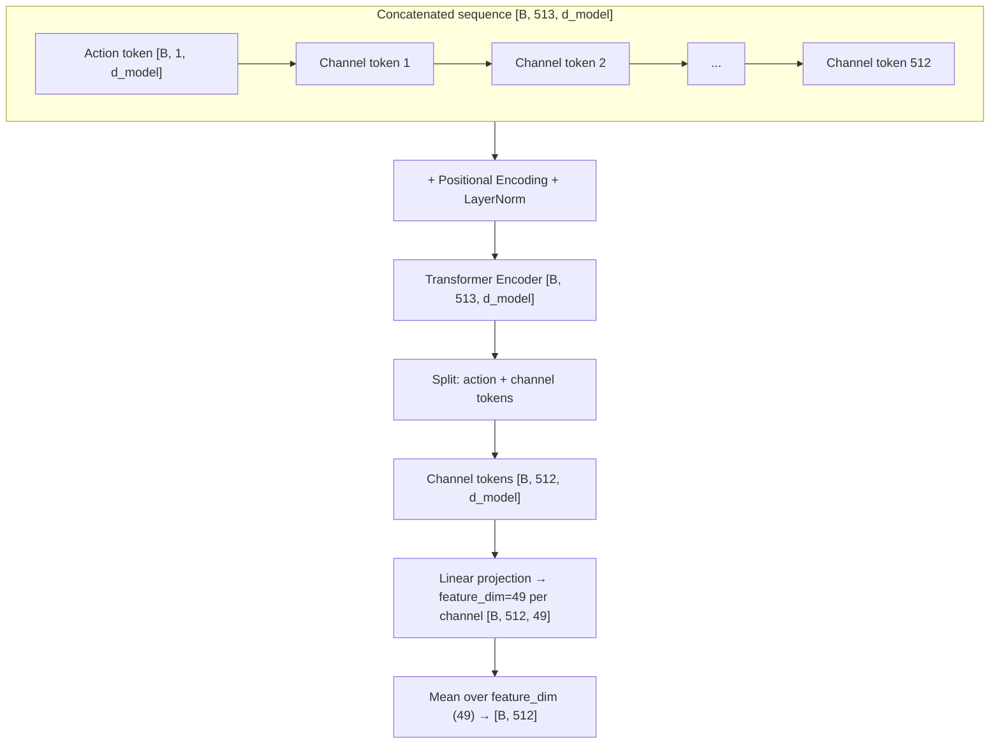

# Model architecture
## src/model
This folder contains the structure and classes of each model component, which are called by the upper-level training processes

### backbone.py

The `backbone.py` module implements a ResNet34-based feature extractor for ultrasound images. It processes single-channel 224×224 inputs and produces feature maps of shape [B, 512, 7, 7]. See implementation: [`src/models/backbone.py`](../src/models/backbone.py).

#### Purpose
- Extract spatial features for downstream transformer-based components.

#### Inputs/Outputs
- Input: `[B, 1, 224, 224]` grayscale ultrasound images
- Output: `[B, 512, 7, 7]` feature maps

#### Key implementation highlights
- Single-channel adaptation of the first convolution (preserves pretrained kernels by channel-averaging):
```python
# src/models/backbone.py
if in_channels != 3:
	original_conv = resnet.conv1
	original_weight = original_conv.weight.data
	resnet.conv1 = nn.Conv2d(
		in_channels,
		original_conv.out_channels,
		kernel_size=original_conv.kernel_size,
		stride=original_conv.stride,
		padding=original_conv.padding,
		bias=original_conv.bias is not None,
	)
	if in_channels == 1:
		resnet.conv1.weight.data = original_weight.mean(dim=1, keepdim=True)
```
- Feature-extractor assembly (classification head removed):
```python
# src/models/backbone.py
self.features = nn.Sequential(
	resnet.conv1, resnet.bn1, resnet.relu, resnet.maxpool,
	resnet.layer1, resnet.layer2, resnet.layer3, resnet.layer4,
)
```
- Optional layer freezing via grouped stages (conv1+bn1, layer1–layer4):
```python
# src/models/backbone.py
for i in range(min(self.freeze_layers, len(layer_groups))):
	for layer in layer_groups[i]:
		for param in layer.parameters():
			param.requires_grad = False
```
- Forward returns backbone features (ready for tokenization):
```python
# src/models/backbone.py
def forward(self, x: torch.Tensor) -> torch.Tensor:
	return self.features(x)  # [B, 512, 7, 7]
```

#### Initialization
- ImageNet-pretrained weights (default) or random initialization are supported.
- Pretrained initialization accelerates convergence and improves stability on limited data.

#### Factory helper
- A convenience constructor provides a clean API for instantiation:
```python
# src/models/backbone.py
def get_resnet34_encoder(in_channels: int = 1, pretrained: bool = True, freeze_layers: int = 0) -> ResNet34Backbone:
	return ResNet34Backbone(in_channels=in_channels, pretrained=pretrained, freeze_layers=freeze_layers)
```

### dreamer_channel.py

The `dreamer_channel.py` module implements the channel-token variant of the Dreamer model. It consumes backbone features reshaped as channel tokens and a 6‑DOF action, then predicts next-frame features for each channel. See implementation: [`src/models/dreamer_channel.py`](../src/models/dreamer_channel.py).

#### Purpose
- Model temporal progression conditioned on an action by transforming 512 channel tokens plus an action token with a Transformer encoder.

#### Inputs/Outputs
- Input channel tokens: `[B, 512, 49]` from reshaping backbone output `[B, 512, 7, 7] → [B, 512, 49]`
- Input action: `[B, 6]` (6‑DOF)
- Output pooled next-frame features: `[B, 512]` (one scalar per channel after pooling)
- Output full sequence (for diagnostics/visualization): `[B, 513, d_model]`

#### Tensor-shape flow (end-to-end)
1) Channel token projection: `[B, 512, 49] → [B, 512, d_model]`
2) Action embedding: `[B, 6] → [B, 1, d_model]`
3) Concatenation: `[B, 1, d_model] + [B, 512, d_model] → [B, 513, d_model]`
4) Positional encoding + LayerNorm: `[B, 513, d_model] → [B, 513, d_model]`
5) Transformer encoder: `[B, 513, d_model] → [B, 513, d_model]`
6) Next-frame projection (per channel token): `[B, 512, d_model] → [B, 512, 49]`
7) Mean pooling over spatial dim: `[B, 512, 49] → [B, 512]`

#### Key implementation highlights
- Channel-token projection (`49 → d_model` per channel):
```python
# src/models/dreamer_channel.py
class ChannelTokenEmbedding(nn.Module):
    def __init__(self, in_dim: int = 49, d_model: int = 768):
        super().__init__()
        self.projection = nn.Linear(in_dim, d_model)
    def forward(self, x: torch.Tensor) -> torch.Tensor:  # x: [B, 512, 49]
        return self.projection(x)  # [B, 512, d_model]
```
- Action embedding (6‑DOF → token):
```python
# src/models/dreamer_channel.py
class ActionEmbedding(nn.Module):
    def __init__(self, d_model: int = 768):
        super().__init__()
        self.action_projection = nn.Sequential(
            nn.Linear(6, 64), nn.ReLU(),
            nn.Linear(64, 256), nn.ReLU(),
            nn.Linear(256, d_model),
        )
    def forward(self, action: torch.Tensor) -> torch.Tensor:  # [B, 6]
        return self.action_projection(action).unsqueeze(1)     # [B, 1, d_model]
```
- Sequence construction and transformer encoding:
```python
# src/models/dreamer_channel.py
channel_emb = self.channel_embedding(channel_tokens)      # [B, 512, d_model]
action_emb  = self.action_embedding(action)               # [B, 1,   d_model]
sequence    = torch.cat([action_emb, channel_emb], dim=1) # [B, 513, d_model]
sequence    = self.pos_encoder(sequence)                  # +PE
sequence    = self.layer_norm(sequence)
transformed_sequence = self.transformer_encoder(sequence) # [B, 513, d_model]
```
- Next-frame feature prediction and pooling:
```python
# src/models/dreamer_channel.py
transformed_action_token   = transformed_sequence[:, 0:1, :]     # [B, 1,   d_model]
transformed_channel_tokens = transformed_sequence[:, 1:, :]      # [B, 512, d_model]
next_frame_features = self.next_frame_projection(                 # [B, 512, 49]
    transformed_channel_tokens
)
pooled_next_frame_features = torch.mean(next_frame_features, dim=2)  # [B, 512]
```
- Optional flash attention (disabled by default; enabled only if available): guarded import to avoid runtime warnings.

#### Notes and conventions
- `d_model` defaults to 768, `feature_dim` to 49 (from 7×7 spatial grid).
- Batch-first layout is used throughout (`[B, seq_len, d_model]`).
- The returned `full_sequence` `[B, 513, d_model]` keeps the action token at index 0 and 512 channel tokens following it.
- A helper `pool_features(...)` is provided to robustly pool channel features when needed.

#### Token layout diagram



### guidance.py

The `guidance.py` module implements the final regression head that maps next‑frame features `ft2'` to a 6‑DOF action prediction `at2'`. In the channel‑token setup, `ft2'` is already pooled to `[B, 512]` by the Dreamer module. See implementation: [`src/models/guidance.py`](../src/models/guidance.py).

#### Purpose
- Convert high‑level next‑frame features into an actionable 6‑DOF probe adjustment prediction.

#### Inputs/Outputs
- Input features: `[B, 512]` (pooled per‑channel features from Dreamer)
- Output action: `[B, 6]` (6‑DOF)

#### Architecture
- A three‑layer MLP with dropout: `512 → 1024 → 512 → 6`
- Default dropout: `0.1`

#### Key implementation highlights
- MLP definition:
```python
# src/models/guidance.py
class GuidanceLayer(nn.Module):
    def __init__(self, feature_dim: int = 512, hidden_dim: int = 1024, dropout: float = 0.1):
        super().__init__()
        self.feature_dim = feature_dim
        self.mlp = nn.Sequential(
            nn.Linear(feature_dim, hidden_dim), nn.ReLU(), nn.Dropout(dropout),
            nn.Linear(hidden_dim, feature_dim), nn.ReLU(), nn.Dropout(dropout),
            nn.Linear(feature_dim, 6),
        )
    def forward(self, features: torch.Tensor) -> torch.Tensor:  # [B, 512] -> [B, 6]
        return self.mlp(features)
```
- Safe pooling helper (only needed if features are not yet pooled):
```python
# src/models/guidance.py
def pool_features(channel_tokens: torch.Tensor) -> torch.Tensor:  # [B, 512, F] -> [B, 512]
    return torch.mean(channel_tokens, dim=2)
```
- Factory helper for clean construction:
```python
# src/models/guidance.py
def get_guidance_layer(feature_dim: int = 512, hidden_dim: int = 1024) -> GuidanceLayer:
    return GuidanceLayer(feature_dim=feature_dim, hidden_dim=hidden_dim)
```

#### Integration example (channel‑token pipeline)
```python
# Backbone: [B, 1, 224, 224] -> [B, 512, 7, 7]
feature_map = backbone(image)
# Reshape to channel tokens: [B, 512, 7, 7] -> [B, 512, 49]
channel_tokens = feature_map.reshape(B, 512, -1)
# Dreamer (channel): [B, 512, 49] + [B, 6] -> pooled next features [B, 512]
predicted_next_features, _ = dreamer(channel_tokens, action)
# Guidance: [B, 512] -> [B, 6]
at2_prime = guidance(predicted_next_features)
```

Notes:
- In the channel‑token variant, Dreamer already returns pooled features `[B, 512]`, so additional pooling is unnecessary.
- If using a variant that outputs `[B, 512, F]`, apply mean over the last dimension before passing to the guidance layer.

### system.py

The `system.py` module defines the end‑to‑end training system as a PyTorch Lightning module. It integrates the backbone, the Dreamer Channel‑Token model, and the guidance layer; implements the forward data flow; composes actions; and defines training/validation/test logic and losses. See implementation: [`src/models/system.py`](../src/models/system.py).

#### Purpose
- Provide a unified, trainable container that wires all model components and training utilities (losses, optimizer, schedulers, logging).

#### Inputs/Outputs (forward)
- Inputs:
  - `image_t1`: `[B, 1, 224, 224]`
  - `a_hat_t1_to_t2_gt`: `[B, 6]` (relative action t1→t2; fed to Dreamer as conditioning)
- Outputs (dictionary):
  - `predicted_action_composed`: `[B, 6]` (composed action at t1, main target)
  - `a_prime_t2_hat`: `[B, 6]` (predicted action at t2, auxiliary target)
  - `predicted_next_feature_tokens`: `[B, 512]` (pooled next‑frame features from Dreamer Channel)

#### Component selection and initialization
```python
# src/models/system.py
self.backbone = get_resnet34_encoder(
	in_channels=in_channels,
	pretrained=use_pretrained,
	freeze_layers=freeze_backbone_layers,
)

# Channel‑token Dreamer
self.dreamer = get_dreamer_channel(
	d_model=d_model, nhead=nhead, num_layers=num_layers,
	feature_dim=feature_dim, use_flash_attn=use_flash_attn,
)

self.guidance = get_guidance_layer(feature_dim=512, hidden_dim=1024)
```

#### Data flow and action composition (channel‑token)
```python
# src/models/system.py
feature_map_t1 = self.backbone(image_t1)                   # [B, 512, 7, 7]
channel_tokens_t1 = feature_map_t1.reshape(B, 512, -1)     # [B, 512, 49]

# Dreamer Channel: tokens + action -> pooled next‑frame features
f_hat_t2_pooled, _ = self.dreamer(channel_tokens_t1, a_hat_t1_to_t2_gt)  # [B, 512]

# Guidance: pooled features -> 6‑DOF action at t2
a_prime_t2_hat = self.guidance(f_hat_t2_pooled)            # [B, 6]

# Compose actions in SE(3)
T_a_hat = dof6_to_matrix(a_hat_t1_to_t2_gt)
T_a_t2  = dof6_to_matrix(a_prime_t2_hat)
T_comp  = torch.matmul(T_a_hat, T_a_t2)
a_t1_prime_composed = matrix_to_dof6(T_comp)               # [B, 6]

return {
	"predicted_action_composed": a_t1_prime_composed,
	"a_prime_t2_hat": a_prime_t2_hat,
	"predicted_next_feature_tokens": f_hat_t2_pooled,
}
```

#### Losses (main + auxiliary)
- Main task: composed action at t1 vs `at1_6dof_gt`
- Auxiliary task: predicted t2 action vs `at2_6dof_gt`
```python
# src/models/system.py
self.smooth_l1_loss = nn.SmoothL1Loss(beta=smooth_l1_beta)

main_task_loss = self.smooth_l1_loss(predicted_action_composed, at1_6dof_gt)
aux_t2_action_loss = self.smooth_l1_loss(a_prime_t2_hat, at2_6dof_gt)

total_loss = (main_task_loss if self.hparams.primary_task_only
              else main_task_loss + self.hparams.lambda_t2_action * aux_t2_action_loss)
```

#### Optimizer and schedulers (overview)
- Optimizer: AdamW with configurable `lr` and `weight_decay`
- Schedulers supported:
  - `cosine` (CosineAnnealingLR)
  - `cosine_warm_restarts` (CosineAnnealingWarmRestarts)
  - `onecycle` (OneCycleLR)

Notes:
- `feature_dim` defaults to 49 (7×7). Dreamer Channel returns pooled `[B, 512]`, which feeds directly into the guidance layer.
- The system logs per‑phase losses and test MSE; validation/test hooks aggregate outputs for plotting and reporting.

### train_modular.py

The `train_modular.py` script orchestrates a single-run training workflow with modular components for data ingestion, augmentation, model construction, scheduling, logging, and optional regularization. See implementation: [`src/train_modular.py`](../src/train_modular.py).

#### Purpose
- Run a standard experiment (as opposed to cross-validation), ideal for iterative development and hyperparameter tuning.

#### Configuration (YAML)
The script consumes a YAML config (recommended: [`configs/channel_token.yaml`](../configs/channel_token.yaml)) with these sections:

- model
  - `d_model`, `num_heads`, `num_layers`, `feature_dim=49`, `in_channels=1`, `use_pretrained`
  - `freeze_backbone_layers`: number of ResNet34 layer groups to freeze (0–4)
  - `lr`, `weight_decay`, `lambda_t2_action`, `smooth_l1_beta`, `primary_task_only`
  - `use_flash_attn`: enable if environment supports it
  - Note: `token_type` is fixed to Channel-Token in the current code path and effectively ignored if present.
- training
  - `batch_size`, `num_workers`, `max_epochs`, `early_stop_patience`, `check_val_every_n_epoch`
  - `gradient_clip_val`, `accumulate_grad_batches`, `log_every_n_steps`, `accelerator`, `precision`
- data
  - `patients.train` / `patients.val` / `patients.test`: explicit patient folder lists (required for train/val; test optional)
  - `augmentation.enabled` plus `rotation_range`, `brightness_range`, `contrast_range`, `noise_std`
- advanced.scheduler
  - `type`: one of `cosine`, `cosine_warm_restarts`, `onecycle`
  - scheduler-specific fields (e.g., `T_max`, `eta_min`, `max_lr`, `total_steps`, …)
- experiment
  - `use_wandb`, `wandb_project`, `wandb_entity`, `tags`, `description`

Example (excerpt):
```yaml
model:
  d_model: 768
  num_heads: 12
  num_layers: 6
  feature_dim: 49
  in_channels: 1
  use_pretrained: true
  freeze_backbone_layers: 0
  lr: 5e-5
  weight_decay: 1e-4
  lambda_t2_action: 1.0
  smooth_l1_beta: 1.0
  primary_task_only: false
  use_flash_attn: true
training:
  batch_size: 16
  num_workers: 4
  max_epochs: 300
  early_stop_patience: 999
  check_val_every_n_epoch: 2
  gradient_clip_val: 1.0
  accumulate_grad_batches: 2
  accelerator: "auto"
  precision: "32-true"
data:
  patients:
    train: ["data_0513_01"]
    val: ["data_0513_02"]
    test: []
  augmentation:
    enabled: false
advanced:
  scheduler:
    type: "cosine"
    T_max: 300
    eta_min: 1e-6
experiment:
  use_wandb: true
  wandb_project: "cardiac-dreamer-demo"
```

#### Data ingestion and splitting
- Dataset class: [`CrossPatientTransitionsDataset`](../src/data/dataset.py)
  - Reads `data/processed/<patient>/transitions_dataset.json` and per-image paths.
  - Requires explicit patient lists from YAML: `data.patients.train/val/test` (train/val required; test optional). No ratio-based or automatic splitting.
  - For each transition, returns: `(image_t1, a_hat_t1_to_t2_gt, at1_6dof_gt, at2_6dof_gt)`.
  - Normalizes AT1/AT2/relative-change using training-split statistics, saved to `data/processed/normalization_stats.json` and loaded for val/test.
- Transform pipeline: [`create_augmented_transform`](../src/data/augmentation.py)
  - Base: `Resize(224,224) → ToTensor() → Normalize(mean=[0.5], std=[0.5])`
  - Optional augmentation if `data.augmentation.enabled=true`: rotation, brightness, contrast, Gaussian noise.
- Patient splitting: explicit lists only via YAML configuration (`data.patients.train/val/test`).

#### DataLoaders
Constructed by [`create_data_loaders`](../src/training/data_loaders.py):
- Train: `shuffle=True`, `drop_last=True`
- Val/Test: `shuffle=False`, `drop_last=False`
- `num_workers = min(config.num_workers, 2)` to avoid memory issues; `pin_memory=True` only if CUDA is available; `persistent_workers=False`.
- Utility [`test_data_loading`](../src/training/data_loaders.py) prints batch shapes:
```text
Image: [B, 1, 224, 224]
Action change (a_hat_t1_to_t2_gt): [B, 6]
At1 6DOF (at1_6dof_gt): [B, 6]
At2 6DOF (at2_6dof_gt): [B, 6]
```

#### Model construction and scheduling
- Model factory: [`get_cardiac_dreamer_system`](../src/models/system.py)
  - Channel-Token Dreamer only; fixed `token_type="channel"`.
  - Passes `d_model`, `num_heads`, `num_layers`, `feature_dim=49`, `use_flash_attn`, `freeze_backbone_layers`.
  - Optimizer: AdamW with `lr`, `weight_decay`.
  - Schedulers supported: `cosine`, `cosine_warm_restarts`, `onecycle` (selected via `advanced.scheduler.type`).
- Config management: [`src/config/config_manager.py`](../src/config/config_manager.py)
  - `get_model_config` and `get_train_config` merge YAML with safe type coercion.

#### Training workflow (end-to-end)
From [`src/train_modular.py`](../src/train_modular.py):
1) Load YAML: `load_config → get_model_config / get_train_config` and save experiment config.
2) Build datasets: `create_enhanced_datasets(...)`
   - Explicit patient lists only (from `data.patients.*`); training transform includes augmentation if enabled; val/test use basic transform.
   - Action normalization stats computed on training split and persisted.
3) Create loaders: `create_data_loaders(...)`; run `test_data_loading(train_loader)` sanity check.
4) Instantiate model: `get_cardiac_dreamer_system(...)`
   - Extract `advanced.scheduler` as `(scheduler_type, scheduler_params)` and pass to the system.
5) Optional regularization utilities
   - EMA: [`ModelEMA`](../src/models/regularization.py) if enabled by your configuration (applied for final evaluation).
   - MixUp: [`create_mixup_augmentation`](../src/data/augmentation.py) if `advanced.mixup_alpha > 0` (hook available in script).
6) Trainer setup: [`setup_callbacks`, `setup_loggers`, `create_training_components`](../src/training)
   - Logging to Weights & Biases if `experiment.use_wandb=true`.
7) Train/evaluate: `trainer.fit(...)` → generate final validation plots via `model.generate_final_validation_plots(...)` → optional `trainer.test(...)` if a test loader is present → save checkpoints and summaries.

#### Command examples
- Single-run training:
```bash
python -m src.train_modular --data_dir data/processed --output_dir outputs --config configs/channel_token.yaml
```
- Resume from checkpoint:
```bash
python -m src.train_modular --data_dir data/processed --output_dir outputs --config configs/channel_token.yaml --resume_from_checkpoint outputs/run_xyz/checkpoints/best_model.ckpt
```
- Notes
  - Configuration file is required (contains explicit patient lists).
  - Ensure your dataset follows the structure in [`docs/03_data.md`](../docs/03_data.md) and that images are 224×224 grayscale.
  - Explicit patient lists are required to prevent data leakage; ratio-based or automatic splits are not supported.
  - `token_type` fields in older configs are ignored; the current pipeline is Channel-Token only.

### train_cross_validation.py

The `train_cross_validation.py` script implements patient-level 5-fold cross-validation. Each predefined patient group serves as validation once, while the remaining groups form the training set. Implementation: [`src/train_cross_validation.py`](../src/train_cross_validation.py).

#### Purpose
- Evaluate generalization with strict patient separation by rotating validation across predefined patient groups.

#### Patient grouping and splits
- Five groups are defined in code and used to construct folds:
```46:54:src/train_cross_validation.py
def get_patient_groups():
    """Define the 5 patient groups for cross-validation"""
    return {
        'patient1': ['data_0513_01', 'data_0513_02', 'data_0513_03', 'data_0513_04', 'data_0513_05'],
        'patient2': ['data_0513_06', 'data_0513_07', 'data_0513_08', 'data_0513_09'],
        'patient3': ['data_0513_11', 'data_0513_12', 'data_0513_13', 'data_0513_14'],
        'patient4': ['data_0513_16', 'data_0513_17', 'data_0513_18', 'data_0513_19', 'data_0513_20','data_0513_21'],
        'patient5': ['data_0513_22', 'data_0513_23', 'data_0513_24', 'data_0513_25', 'data_0513_26']
    }
```
- For fold k, the validation set is the k-th group; training set is the union of the remaining groups.
- No test set is used in CV; metrics are aggregated across validation folds and summarized.

#### Inputs/Outputs
- Inputs (CLI): `--data_dir`, `--output_dir`, `--config` (required).
- Uses the same dataset and transform utilities as the modular pipeline, but builds splits from the predefined groups.
- Outputs per fold: checkpoints, logs, plots, and statistics. A final report is generated across all folds.

#### Training setup
- Fixed to 100 epochs per fold; all other trainer options are loaded from `training` section of the YAML.
- Scheduler/optimizer/model settings are read from the same YAML sections as single-run training.
- Logging integrates with Weights & Biases if enabled in the YAML; tags are adjusted per fold.

#### Command example
```bash
python -m src.train_cross_validation --data_dir data/processed --output_dir outputs --config configs/channel_token_cv.yaml
```

#### Outputs
- Cross-validation output directory contains:
  - `cv_summary_report.json`: aggregate metrics across folds
  - `cv_detailed_results.csv`: per-fold results
  - `cv_results_visualization.png`: performance plots
  - `patient_group_mapping.png`: fold/group overview
  - `fold_*/`: one directory per fold with checkpoints, logs, `fold_dataset_statistics.png`, and `fold_statistics.json`


### run_cross_validation.py

The `run_cross_validation.py` script is a convenience launcher for 5-fold CV. It validates paths, prints the assembled command, asks for confirmation, and then executes the cross-validation script. Implementation: [`run_cross_validation.py`](../run_cross_validation.py).

#### Purpose
- Provide a simple entry point to start CV with sensible defaults, ensuring required files exist.

#### Key behavior
- Builds the command to run the CV trainer:
```49:56:run_cross_validation.py
# Construct command
cmd = [
    sys.executable,
    "src/train_cross_validation.py",
    "--data_dir", data_dir,
    "--output_dir", output_dir,
    "--config", config_file
]
```
- Asks for user confirmation before launching (long-running job):
```61:66:run_cross_validation.py
# Ask for confirmation
response = input(" Start cross-validation? This will take several hours. (y/N): ")
if response.lower() not in ['y', 'yes']:
    print(" Cross-validation cancelled by user.")
    return
```

#### Command example
- From repository root:
```bash
python run_cross_validation.py
```
- If non-interactive environments are preferred, call the trainer directly:
```bash
python -m src.train_cross_validation --data_dir data/processed --output_dir outputs --config configs/channel_token_cv.yaml
```

#### Notes
- Defaults: `data_dir="data/processed"`, `output_dir="outputs"`, `config_file="configs/channel_token_cv.yaml"`.
- The launcher requires a keypress; for unattended runs, invoke `src/train_cross_validation.py` directly as shown above.
