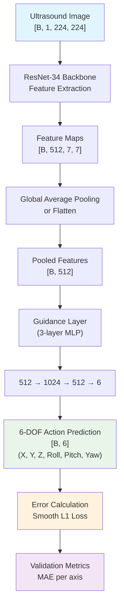
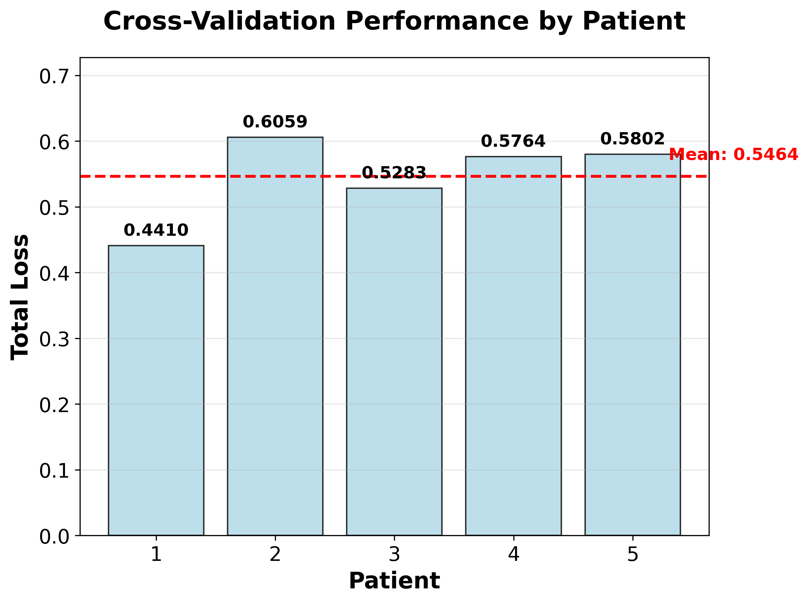
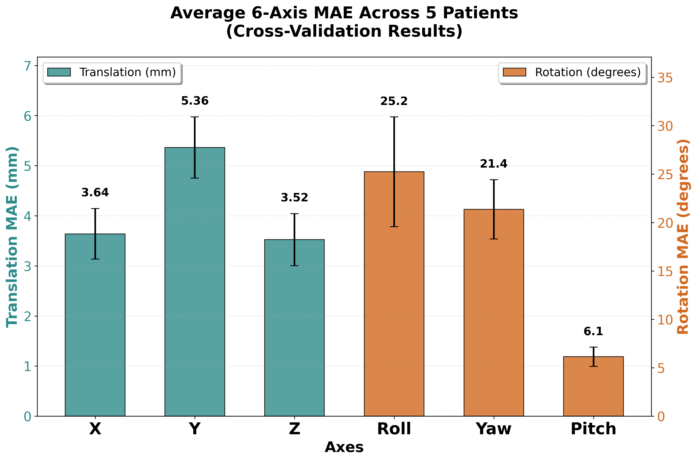
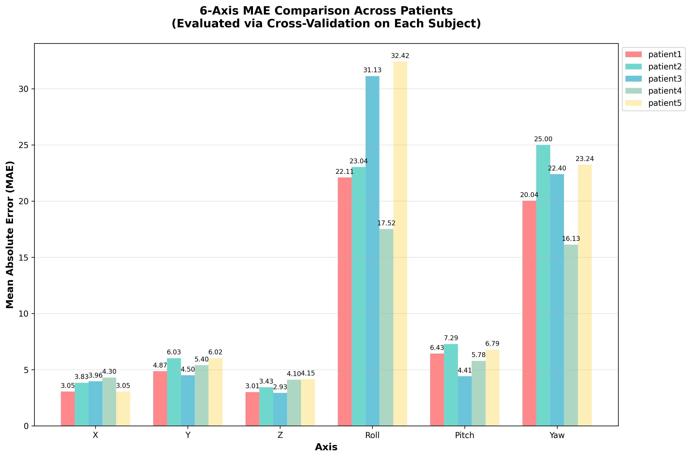
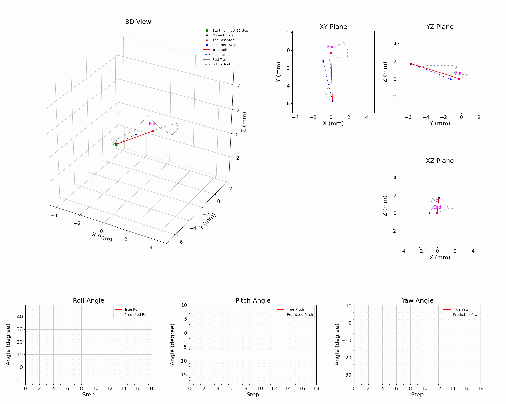
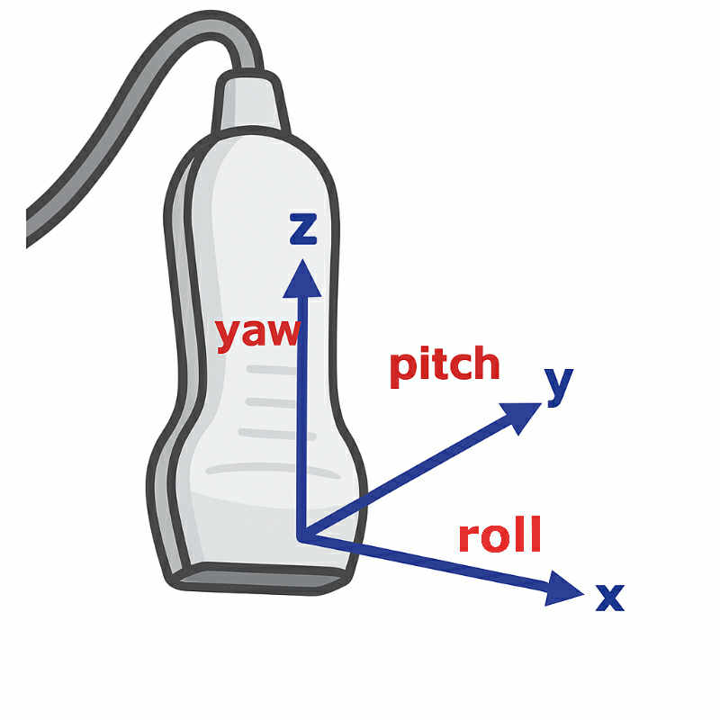

# Results

This document summarizes the model validation methodology and reports the main results, including 5-fold cross-validation outcomes. 

### Validation Methodology

- **Data protocol**:
  - Patient-level separation with 5 predefined groups; each group serves once as validation while the others train
  - No test set during cross-validation; evaluation aggregates across validation folds
- **Fold definition**:
```46:54:src/train_cross_validation.py
def get_patient_groups():
    """Define the 5 patient groups for cross-validation"""
    return {
        'patient1': ['data_0513_01', 'data_0513_02', 'data_0513_03', 'data_0513_04', 'data_0513_05'],
        'patient2': ['data_0513_06', 'data_0513_07', 'data_0513_08', 'data_0513_09'],
        'patient3': ['data_0513_11', 'data_0513_12', 'data_0513_13', 'data_0513_14'],
        'patient4': ['data_0513_16', 'data_0513_17', 'data_0513_18', 'data_0513_19', 'data_0513_20','data_0513_21'],
        'patient5': ['data_0513_22', 'data_0513_23', 'data_0513_24', 'data_0513_25', 'data_0513_26']
    }
```
- **Metrics**:
  - Primary: Validation loss (Smooth L1) per fold, calculated as the sum of main task loss (at1 and at1 prediction).
  - Secondary: Mean Absolute Error (MAE) for each of the 6 axes (X, Y, Z translation and Roll, Pitch, Yaw rotation)

- **Inference model architecture**:
  - ResNet-34 backbone for feature extraction from single ultrasound images
  - Guidance layer for direct action prediction from extracted features
  - Single-image inference: each image generates one optimal action prediction for error calculation and validation
  - No temporal modeling during validation (direct image-to-action mapping)

#### Validation Architecture Flow



*Figure: Validation inference pipeline showing the direct image-to-action mapping used during cross-validation. The architecture bypasses temporal modeling components and focuses on single-frame prediction accuracy.*

### Cross-Validation Results

#### Overall Performance Across Patients

The cross-validation evaluation reveals varying performance across the five patient groups:



*Figure 1: Validation loss for each patient group during cross-validation. The results show inconsistent performance across patients. This variability indicates that the model's generalization capability requires further improvement.*

#### 6-Axis MAE Analysis



*Figure 2: Average Mean Absolute Error across all 6 degrees of freedom. Translation errors remain relatively low (X: 3.64mm, Y: 5.36mm, Z: 3.52mm), while rotation errors are significantly higher (Roll: 25.2°, Yaw: 21.4°, Pitch: 6.1°). The results indicate that rotational prediction performance is considerably worse than translational prediction, suggesting greater difficulty in accurately estimating probe orientation changes.*

#### Per-Patient Performance Breakdown



*Figure 3: Detailed 6-axis MAE comparison across all five patients. This visualization shows individual patient performance for each degree of freedom, revealing patient-specific strengths and challenges in different motion axes.*


#### Demo video 





> In the video, the red line points to the target endpoint, and the blue line shows the predicted endpoint generated by our inference model for the current position. The reference image shows the probe orientation correspondence for interpreting the movement directions.

**Animation Generation:**
The demo animation was created using our visualization toolkit: [plotAnimation](https://github.com/Yun0921/plotAnimation/tree/main). This repository contains scripts for generating animated visualizations from model prediction results, including trajectory plotting and comparative analysis between predicted and ground truth movements. 


Analysis scripts used for visualization:
- `results/scripts/plot_cv_performance.py`: Patient performance comparison
- `results/scripts/plot_6axis_average_mae.py`: Average MAE across axes
- `results/scripts/plot_6axis_mae.py`: Detailed per-patient MAE comparison

